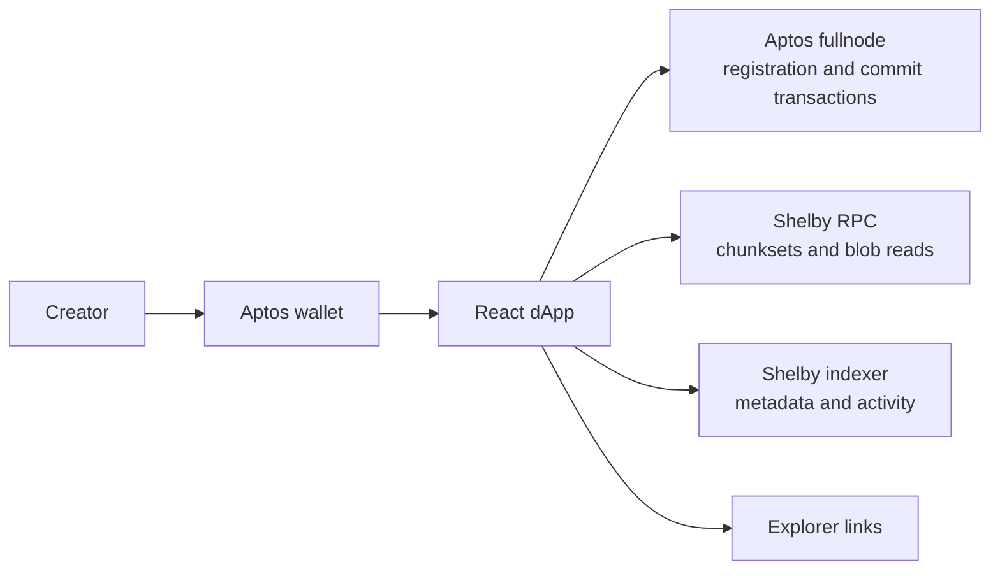

# ShelbyID

> A wallet-linked identity and portfolio surface for creators, built on ShelbyNet and Aptos.

[Live app](https://shelby-id.vercel.app/) | [Source code](https://github.com/Jeaaanotfound/shelby-id) | [Shelby Protocol](https://docs.shelby.xyz/protocol)


## Overview

ShelbyID gives creators a readable public surface for identity metadata and work stored on Shelby. A creator connects an Aptos wallet, publishes a ShelbyID profile, and uses the same wallet-linked namespace for an avatar and portfolio files.

The application is designed to make Shelby storage understandable outside the storage layer itself. Instead of presenting a list of raw blob records, ShelbyID combines identity, presentation, verification metadata, file organization, and explorer links in one interface.

ShelbyID is currently a ShelbyNet-only working prototype. It is intended for community testing and technical review, not as a claim of permanent storage or immutable user content.

## Product surfaces

| Surface | Purpose |
| --- | --- |
| Home | Explains the product and lets visitors open a wallet-linked profile. |
| Mint | Publishes identity metadata such as display name, bio, social handle, and category. |
| Workspace | Uploads creator files and shows recent work, storage footprint, and file mix. |
| Gallery | Presents public portfolio files in a curated grid or list view. |
| Profile | Shows identity metadata, avatar, published works, verification data, and external links. |

## What is stored on Shelby

ShelbyID uses the `shelbyid` namespace and wallet-scoped blob names:

```text
shelbyid/<wallet-address>/identity.json
shelbyid/<wallet-address>/avatar
shelbyid/<wallet-address>/<sanitized-file-name>
```

`identity.json` and `avatar` are reserved records. They are read separately from portfolio files and are excluded from portfolio counts.

New identity, avatar, and portfolio writes currently use a 365-day blob expiration. Existing records keep the expiration that was set when they were written. The application displays expiration information in the Profile verification panel.

## Architecture



The app is a Vite single-page application deployed as static assets on Vercel. It does not use a private application server for blob writes. Browser-safe API keys are used for Shelby and Aptos endpoints, while transaction approval remains in the user's wallet.

### Write lifecycle

The current write path is deliberately explicit so the UI can report each stage:

1. Check that the connected wallet is on ShelbyNet.
2. Check the wallet's ShelbyNet APT and ShelbyUSD balances.
3. Generate erasure-coding commitments for each file in the browser.
4. Ask the wallet to approve batch blob registration on Aptos.
5. Upload verified chunksets through Shelby RPC.
6. Ask the wallet to approve the `commit_object` transaction for each blob.
7. Wait for transaction confirmation and Shelby coordination metadata.
8. Read the blob metadata back and verify `isWritten`, byte size, and Merkle root.
9. Only then show a successful upload notification.

The current implementation normally requires one registration approval and one commit approval per blob. A multi-file upload can therefore produce several wallet prompts.

### Verification model

An HTTP response alone is not treated as a successful write. The app waits for the Aptos transaction, storage-provider acknowledgements, commit confirmation, and Shelby read-back metadata. If ShelbyNet returns a service error, the UI keeps the operation unconfirmed instead of presenting it as stored.

## ShelbyNet configuration

ShelbyID targets ShelbyNet only. It does not expose a Testnet switch or use Testnet as a write target.

| Component | Endpoint |
| --- | --- |
| Aptos fullnode | `https://api.shelbynet.shelby.xyz/v1` |
| Shelby RPC | `https://api.shelbynet.shelby.xyz/shelby` |
| Shelby indexer | `https://api.shelbynet.shelby.xyz/v1/graphql` |
| Shelby Explorer | `https://explorer.shelby.xyz/shelbynet` |

ShelbyNet is a developer or builder network and may be reset periodically. A reset can remove previously written test data even when the application code is working correctly. For that reason, ShelbyID describes records as ShelbyNet-backed and time-bounded rather than permanent.

## Technology

- React 18
- TypeScript
- Vite
- `@aptos-labs/ts-sdk`
- Aptos Wallet Adapter
- `@shelby-protocol/sdk`
- `@shelby-protocol/react`
- TanStack Query
- Vite WASM and top-level-await plugins for browser-side erasure coding
- Vercel

The primary Shelby package versions currently used by the application are:

```text
@shelby-protocol/sdk    0.6.0
@shelby-protocol/react  4.1.0
@aptos-labs/ts-sdk      5.2.1
```

## Getting started

### Requirements

- A current Node.js LTS release
- npm
- An Aptos-compatible browser wallet such as Petra
- ShelbyNet access and a valid browser/client API key
- ShelbyNet APT for transaction gas
- ShelbyUSD for Shelby storage operations

### Install and run locally

```bash
git clone https://github.com/Jeaaanotfound/shelby-id.git
cd shelby-id
npm install
copy .env.example .env
npm run dev
```

On macOS or Linux, use `cp .env.example .env` instead of `copy`.

The development server prints the local URL, normally `http://localhost:5173`.

### Environment variables

Create `.env` in the project root:

```env
VITE_SHELBY_SHELBYNET_API_KEY=
VITE_APTOS_SHELBYNET_API_KEY=
```

| Variable | Required | Purpose |
| --- | --- | --- |
| `VITE_SHELBY_SHELBYNET_API_KEY` | Yes | Browser/client access to ShelbyNet reads, metadata, and writes. |
| `VITE_APTOS_SHELBYNET_API_KEY` | Recommended | Browser/client access to Aptos fullnode requests. |

All `VITE_*` values are exposed to the browser by design. Use browser/client keys only. Never place an admin, secret, or server-only key in `.env`, Vercel environment variables with a `VITE_` prefix, or committed source code.

## Commands

```bash
npm run dev       # Start the Vite development server
npm run build     # Type-check and create the production bundle
npm run preview   # Preview the production bundle locally
```

The repository currently uses the production build as its automated release gate. A dedicated unit and browser test suite is still planned; the manual ShelbyNet acceptance matrix is tracked in [`list 2.md`](./list%202.md).

## Vercel deployment

Create or reuse the Vercel project connected to the existing GitHub repository.

| Setting | Value |
| --- | --- |
| Framework preset | `Vite` |
| Build command | `npm run build` |
| Output directory | `dist` |
| Production branch | `main` |

Add these environment variables to the Vercel environments that will be tested:

```text
VITE_SHELBY_SHELBYNET_API_KEY
VITE_APTOS_SHELBYNET_API_KEY
```

After changing an environment variable, create a fresh deployment. A local `.env` file is not uploaded to Vercel and should never be committed.

## Review and acceptance checklist

Before presenting the project for review, verify the deployed ShelbyNet application rather than relying only on a local build:

- Wallet detection and reconnect after refresh
- Wrong-network warning and rejected-transaction notification
- New ShelbyID mint and Profile read-back
- Avatar upload and fallback when no avatar exists
- Small file upload and an image around 1 MB
- Multi-file upload and visible per-file progress
- ShelbyNet `401`, `404`, and `500` error messaging
- Public Profile and Gallery links without a connected wallet
- Correct ShelbyNet blob explorer and transaction explorer links
- Expiration, commitment, status, and registration activity in Profile
- Empty identity, empty gallery, and not-indexed metadata states

The detailed execution plan is in [`list 2.md`](./list%202.md). Project decisions and implementation constraints are recorded in [`tasks.md`](./tasks.md) and [`memory.md`](./memory.md).

## Current limitations

- ShelbyNet may reset, so test data should not be treated as durable production data.
- New writes expire after 365 days unless a future renewal flow extends them.
- The current public gallery is a presentation layer; it does not provide private access control.
- Uploading multiple files can require multiple wallet approvals.
- Large browser bundles include the erasure-coding runtime and may benefit from further code splitting.
- Automated test coverage is not yet part of the repository's release gate.
- Public share links must be tested from a disconnected browser to ensure the shared wallet address, not the visitor wallet, drives the view.

## Repository map

```text
src/
  components/       Product surfaces and reusable UI components
  context/          App settings, wallet runtime, and notifications
  hooks/            Identity, avatar, blob, and wallet data hooks
  lib/              ShelbyNet configuration, reads, writes, and transactions
  App.tsx           Page selection and share URL handling
  main.tsx          React, wallet, query, and app providers
public/             Static brand and favicon assets
docs/               Product documentation assets and screenshots
```

Key implementation files:

- `src/lib/aptos.ts` - ShelbyNet configuration, address normalization, and explorer URLs
- `src/lib/shelby.ts` - Shelby client, blob naming, reads, expiration, and error messages
- `src/lib/shelbyWrite.ts` - registration, chunkset upload, commit, confirmation, and read-back verification
- `src/lib/transactions.ts` - wallet network detection and transaction error handling
- `src/components/CreateID.tsx` - identity mint flow
- `src/components/Dashboard.tsx` - workspace upload flow
- `src/components/Gallery.tsx` - public gallery and file presentation
- `src/components/Profile.tsx` - identity, verification, and published works

## Design direction

ShelbyID uses a restrained editorial interface rather than a generic Web3 dashboard. The visual system prioritizes:

- Clear hierarchy over dense control panels
- A curated archive feel for creator work
- Dark and light themes with the same information structure
- Readable wallet and storage verification details
- Deliberate empty, loading, success, rejection, and service-failure states

## License

MIT
