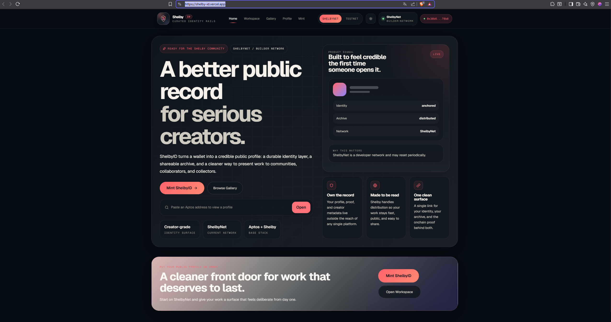

# ShelbyID

ShelbyID is a creator identity layer built on Shelby Protocol and Aptos. It turns a wallet into a public profile, a shareable archive, and a cleaner way to present work stored on Shelby.



Live: [shelby-id.vercel.app](https://shelby-id.vercel.app/)  
Repo: [Jeaaanotfound/shelby-id](https://github.com/Jeaaanotfound/shelby-id)

## What ShelbyID does

ShelbyID gives creators a network-backed public surface on top of decentralized storage.

- Mint a Shelby-backed identity tied to an Aptos wallet
- Upload media to Shelby and keep it organized as a real profile, not a raw blob list
- Publish a shareable gallery with profile metadata, avatar, and archived work
- Keep wallet, Aptos registration, Shelby reads, writes, and explorer links on ShelbyNet
- Show the storage record behind a profile, including write status, expiry, commitment reference, and registration activity when indexed
- Present onchain work in a way that feels usable to communities, collaborators, and collectors

## Why it exists

Shelby storage is strong infrastructure, but most people do not want to interact with infrastructure directly. ShelbyID gives that storage a front door: identity, presentation, and a public link that feels intentional.

## Product surfaces

- Home: a premium landing surface that explains the identity layer
- Mint: create a ShelbyID profile and store identity metadata on Shelby
- Workspace: upload and manage creator files
- Gallery: present public work through a cleaner archival view
- Profile: show identity, avatar, and creator metadata in one place

## Stack

- React
- TypeScript
- Vite
- Aptos TypeScript SDK
- Aptos Wallet Adapter
- Shelby Protocol SDK and React hooks
- TanStack Query
- Vercel

## Network

ShelbyID currently targets ShelbyNet only. The app deliberately does not expose a Testnet switch or accept Testnet as a write target. New blobs use a 365-day expiration and the profile exposes that expiry. ShelbyNet is a builder network and may reset, so the app treats storage as network-backed rather than making permanent-storage claims.

## Local development

```bash
git clone https://github.com/Jeaaanotfound/shelby-id
cd shelby-id
npm install
npm run dev
```

Create a `.env` file in the project root:

```env
VITE_SHELBY_SHELBYNET_API_KEY=
VITE_APTOS_SHELBYNET_API_KEY=
```

If you only have Shelby API keys, the app can still use those without the Aptos-specific ones.

## Deployment

For Vercel:

- Framework Preset: `Vite`
- Build Command: `npm run build`
- Output Directory: `dist`
- Production Branch: `main`

Environment variables:

- `VITE_SHELBY_SHELBYNET_API_KEY`
- `VITE_APTOS_SHELBYNET_API_KEY`

## References

- [Shelby Docs](https://docs.shelby.xyz)
- [Shelby Explorer](https://explorer.shelby.xyz)
- [Aptos Docs](https://aptos.dev)

## License

MIT
